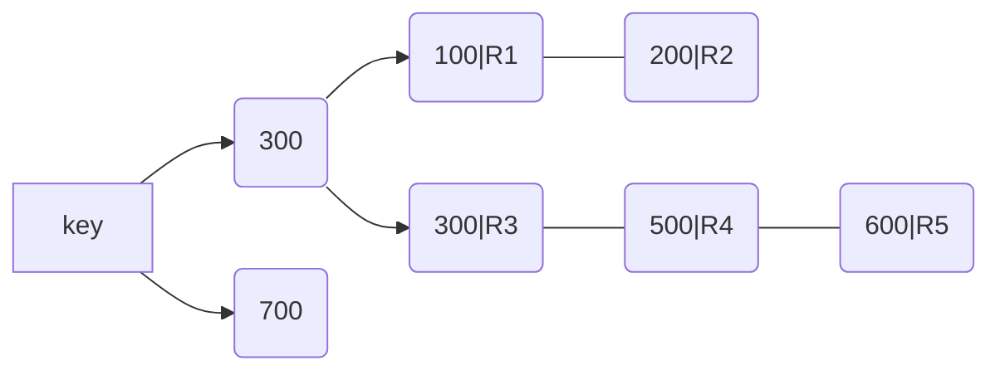
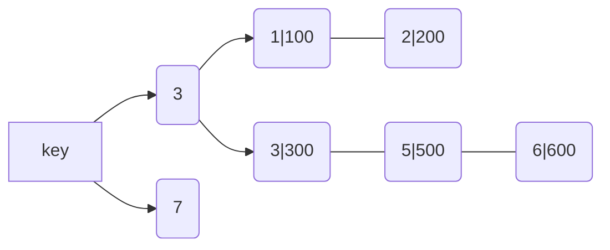

<!--more-->
## 索引
> 索引概念类似于书的目录，目的是提高数据查询效率。

[comment]: <> (## 类型)

[comment]: <> (- B+树)

[comment]: <> (- 哈希)

[comment]: <> (- R树)

[comment]: <> (- 全文索引)

[comment]: <> (- 其他)

## 索引类型
以InnoDB为例，索引类型分为四种
- FULLTEXT
- NORMAL
- SPATIAL
- UNIQUE

### 全文索引 (FULLTEXT)
### 普通索引 (NORMAL)
### 空间索引 (SPATIAL)
### 唯一索引 (UNIQUE)


## 索引方法
以InnoDB为例，索引方法分为两种
- B+树
- HASH

### B+树
此数不再赘述数据结构，如需了解查看：[数据结构与算法](https://fe1.fan/tags/data-structures-algorithms/)

在InnoDB中，每个索引对应一棵B+树。

假设建表语句
```sql
CREATE TABLE TEST (
	id int PRIMARY KEY,
	k int NOT NULL,
	name varchar(20),
	INDEX(k)
) ENGINE = InnoDB;

INSERT INTO TEST (id, k)
VALUES  (100, 1),
	(200, 2),
	(300, 3),
	(500, 5),
	(600, 6);
```
此时 id、k索引分别为两棵B+树

id:


k:


根据字节点内容，索引类型分为主键索引和非主键索引。

主键索引保存的是整行的数据，在InnoDB中主键索引也被成为聚簇索引。

非主键索引的叶节点上存的是主键的值，在InnoDB中，非主键索引也被成为二级索引。

当查询语句索引走的是非主键索引时，搜索到内容后再根据主键内容到主键树搜索一次，这个过程被称为回表。

### HASH

## 索引优化

当根据k查询时:
```sql
SELECT * FROM TEST WHERE k BETWEEN 3 AND 5
```
SQL的执行步骤如下：
1. 在 k 索引树上找到 k=3 的记录，取得 ID = 300;
2. 再到 ID 索引树查到 ID=300 对应的 R3;
3. 在 k 索引树取下一个值 k=5，取得 ID=500;
4. 再回到 ID 索引树查到 ID=500 对应的 R4;
5. 在 k 索引树取下一个值 k=6，不满足条件，循环结束。

以上面的SQL为例，我们把SQL更改为：
```sql
SELECT id FROM TEST WHERE k BETWEEN 3 AND 5
```
当查询ID时，ID已经存在于树上，树可以直接提供查询结果，不需要回表，此时k已经覆盖了我们的查询需求，成为覆盖索引。

**需要注意的是，在引擎内部使用覆盖索引在索引 k 上其实读了三个记录，R3~R5(对应的 索引 k 上的记录项)，但是对于 MySQL 的 Server 层来说，它就是找引擎拿到了两条记 录，因此 MySQL 认为扫描行数是 2。**

假设表:
```sql
CREATE TABLE `user` (
	`id` int(11) NOT NULL,
	`id_card` varchar(32) DEFAULT NULL,
	`name` varchar(32) DEFAULT NULL,
	`age` int(11) DEFAULT NULL,
	`is_male` tinyint(1) DEFAULT NULL,
	PRIMARY KEY (`id`),
	KEY `id_card` (`id_card`),
	KEY `name_age` (`name`, `age`)
) ENGINE = InnoDB
```
身份证作为唯一标识作为索引，假设当前情况要根据身份证查询姓名，有没有必要再建立(身份证号、姓名)索引？

如果现在有一个高频请求，要根据市民的身份证号查询他的姓名，这个联合索引就有意义
了。它可以在这个高频请求上用到覆盖索引，不再需要回表查整行记录，减少语句的执行时间。

name_age 索引项如下：


索引项是按照索引定义里面出现的字段顺序排序的。
